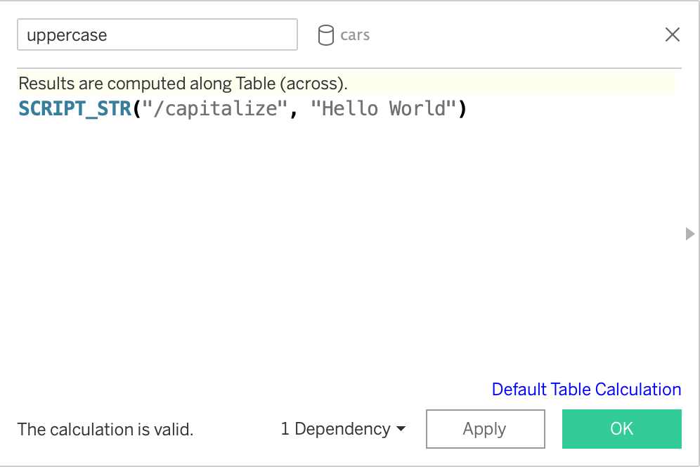

<!-- README.md is generated from README.Rmd. Please edit that file -->

```{r setup, include = FALSE}
knitr::opts_chunk$set(
  collapse = TRUE,
  comment = "#>",
  eval = FALSE,
  fig.path = "man/figures/README-",
  out.width = "100%"
)

# R chunks
knitr::read_chunk(path = system.file("plumber", "capitalize", "plumber.R", package = "plumbertableau"),
                  from = 9,
                  labels = "capitalize")
```

# plumbertableau

<!-- badges: start -->
[](https://github.com/rstudio/plumbertableau/actions)
[](https://codecov.io/gh/rstudio/plumbertableau?branch=main)
<!-- badges: end -->

An R package that helps create [Plumber APIs](https://www.rplumber.io/) that are
compliant with the [Tableau Analytics Extension
API](https://tableau.github.io/analytics-extensions-api/#).

## Installation

You can install the development version of plumbertableau from
[GitHub](https://github.com/rstudio/plumbertableau) with:


```{r}
remotes::install_github("rstudio/plumbertableau")
```

## Example

The main object in `plumbertableau` is `tableau_extension`. This is a function
that modifies an existing Plumber router so that it complies with the
specification set forward by the Tableau Analytics Extensions API. If you're
writing a Plumber API, you don't call this function directly — instead, place it
at the bottom of your extension, annotated with the `#* @plumber` decorator, as
in the following example:

```{r capitalize}
```

In order to use an analytics extension from Tableau, you need to configure the
extension for either [Tableau
Desktop](https://tableau.github.io/analytics-extensions-api/docs/ae_connect_desktop.html)
or [Tableau
Server](https://tableau.github.io/analytics-extensions-api/docs/ae_connect_server.html).

When this API is running, it can be used via a calculated field in Tableau. To
use to example above, you could create a calculated field like the following:



A `SCRIPT_` function in Tableau takes two arguments: `string` and `expression`.
When using `plumbertableau`, the `string` argument is the path to the endpoint
you want to use (in this case `/capitalize`). The subsequent `expression` can be
a constant value (in this case `"Hello World"`) or a reference to a data object
in Tableau.
