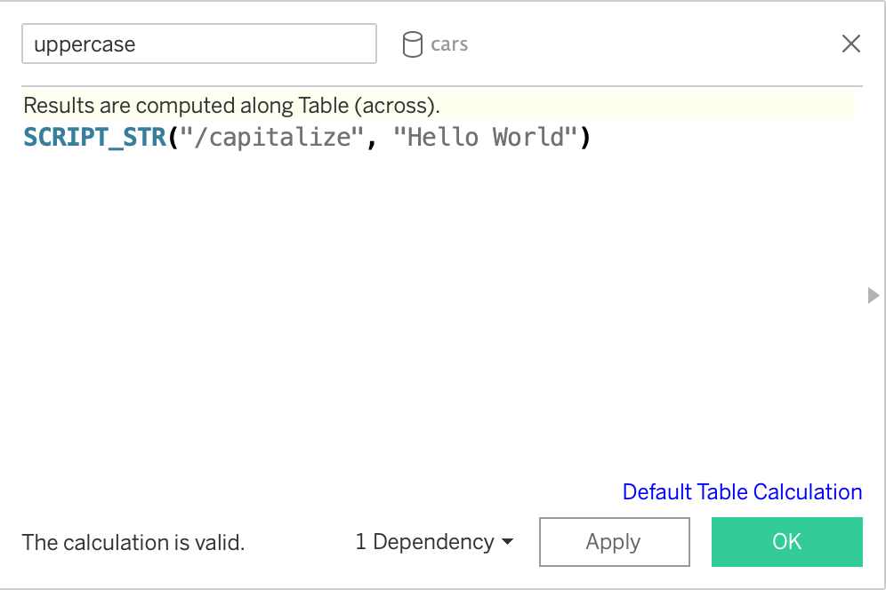

# rtab

<!-- badges: start -->
<!-- badges: end -->

An R package that helps create [Plumber APIs](https://www.rplumber.io/) that are
compliant with the [Tableau Analytics Extension
API](https://tableau.github.io/analytics-extensions-api/#).

## Installation

You can install the development version of rtab from
[GitHub](https://github.com/rstudio/rtab) with:

``` r
remotes::install_github("rstudio/rtab")
```

## Example

The main function in `rtab` is `tableau_extension()`. This function takes an
existing Plumber router and modifies it so that it complies with the
specification set forward by the Tableau Analytics Extensions API.

``` r
library(plumber)
library(rtab)

#* @apiTitle A simple Tableau Extensions API

#* Capitalize incoming text
#* @parser json
#* @serializer json
#* @post /capitalize
function(req, res) {
  dat <- req$body$data
  toupper(dat)
}

#* @plumber
tableau_extension
```

In order to use an analytics extension from Tableau, you need to configure the
extension for either [Tableau
Desktop](https://tableau.github.io/analytics-extensions-api/docs/ae_connect_desktop.html)
or [Tableau
Server](https://tableau.github.io/analytics-extensions-api/docs/ae_connect_server.html).

When this API is running, it can be used via a calculated field in Tableau. To
use to example above, you could create a calculated field like the following:



A `SCRIPT_` function in Tableau takes two arguments: `string` and `expression`.
When using `rtab`, the `string` argument is the path to the endpoint you want to
use (in this case `/capitalize`). The subsequent `expression` can be a constant
value (in this case `"Hello World"`) or a reference to a data object in Tableau.
