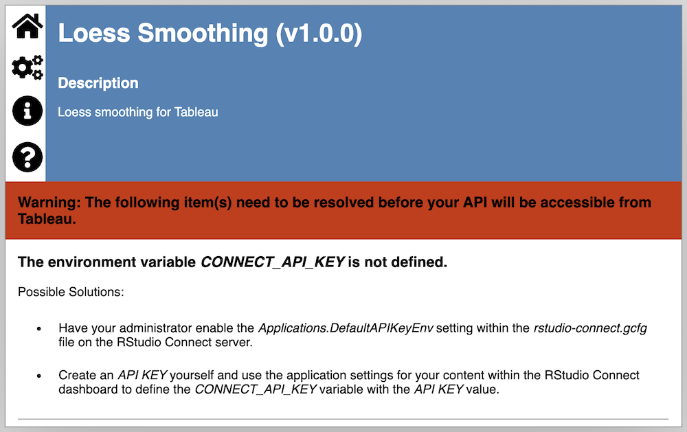

```{r, include = FALSE}
knitr::opts_chunk$set(
  collapse = TRUE,
  comment = "#>"
)
```

```{r setup, include = FALSE}
library(plumbertableau)
```

[RStudio Connect](https://www.rstudio.com/products/connect/) is a publishing platform for sharing the work produced by data science teams. It supports content in both R and Python, including Shiny apps and Plumber APIs. You can publish content to RStudio Connect [in a number of ways](https://docs.rstudio.com/connect/user/publishing/), including 1-click publishing from the RStudio IDE.

plumbertableau integrates seamlessly with RStudio Connect. You can host any number of plumbertableau extensions on RStudio Connect, and Connect will ensure that requests from Tableau are passed to the correct extension.

## Setting up RStudio Connect {#connect}

### Requirements {#requirements}

- Tableau extensions are only supported in RStudio Connect [VERSION NUMBER] and above.
- RStudio Connect must be configured with the following settings:
  - [`TableauExtension.Enabled`](https://docs.rstudio.com/connect/admin/appendix/configuration/#TableauExtension) must be `True`.
  - [`Server.Address`](https://docs.rstudio.com/connect/admin/appendix/configuration/#Server.Address) must be configured.

See the [RStudio Connect Admin Guide](https://docs.rstudio.com/connect/admin/appendix/configuration/) for more information about configuring Connect.

Extensions published to an incompatible RStudio Connect server will an error message that detects which of the above criteria are not met.

{width="75%"}

### Access, Permissions, and Security {#access}

Your RStudio Connect server must be [configured as an Analytics Extension in Tableau](TODO link to setting up tableau). Tableau requires an [API key](https://docs.rstudio.com/connect/user/api-keys/) to authenticate with RStudio Connect. This API key will be used for all requests from Tableau to RStudio Connect, and the Tableau instance will have access to any content on Connect that the API can access.

We recommend creating a "service account" (an account not used only by Tableau, not by any individual) on RStudio Connect, and configuring Tableau with API key for this account. If you name the service account "Tableau", simply add the "Tableau" to the [Access List](https://docs.rstudio.com/connect/user/content-settings/#content-access) for any content it should be able to access. This way, you can more finely control what content Tableau can access without affecting any users.

##  Using Custom URLs for plumbertableau Extensions on RStudio Connect {#deploying}

All content hosted on RStudio Connect receives randomized identifier, which is used as part of its default URL. You can optionally [set a custom URL](https://docs.rstudio.com/connect/user/content-settings/#custom-url) (called a vanity URL) for any piece of content on RStudio Connect in its control panel. By default, only administrators can assign vanity paths, but RStudio Connect [can be configured](https://docs.rstudio.com/connect/admin/content-management/#vanity-paths) to allow all publishers to assign them.

We recommend using vanity paths for plumbertableau extensions. You must use a content identifier in calls to Tableau extensions, and a vanity URL makes the difference between `SCRIPT_REAL("/content/c8b1e158-4fab-4d09-9791-8674afba86eb/predict", ...)` and `SCRIPT_REAL("/loess/predict", ...)`.

This isn't required. You can access extensions published to RStudio Connect by their content identifier or vanity URL. If an extension has a vanity URL, RStudio Connect will prefer that in all of the documentation it generates.

## Debugging plumbertableau Extensions on RStudio Connect {#debugging}

plumbertableau supports debug logging via the [`debugme`](https://github.com/r-lib/debugme) R package.

To enable debug logging on a deployed extension, [open the "Vars" section of the content control panel](https://docs.rstudio.com/connect/user/content-settings/#content-vars) in RStudio Connect. Ensure that an environment variable called `DEBUGME` exists and that it contains the text `plumbertableau`.

Additional messages will appear in the "Logs" tab of the control panel, with information about the contents and processing of each request the extension receives.
