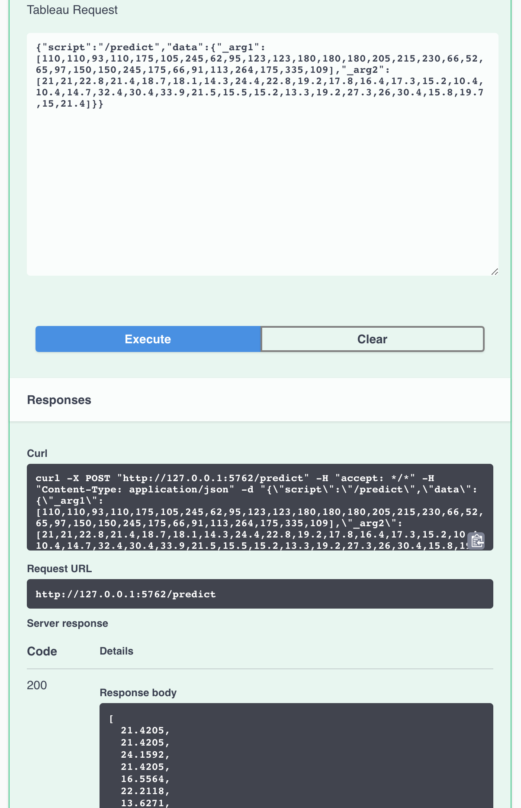

```{r, include = FALSE}
knitr::opts_chunk$set(
  collapse = TRUE,
  comment = "#>"
)

# Load package
library(plumbertableau)

# Set random seed
set.seed(35487)

# R chunks
knitr::read_chunk(path = system.file("plumber", "loess", "plumber.R", package = "plumbertableau"),
                  labels = "loess")
```


## Getting started {#getting-started}

This vignette will walk you through writing plumbertableau extensions in R. plumbertableau extensions are Plumber web services with a few additional pieces, and this vignette assumes some familiarity with Plumber (https://www.rplumber.io/). Plumber's [Quickstart guide](https://www.rplumber.io/articles/quickstart.html) gives a good overview of that package.

You can install the plumbertableau package from CRAN or GitHub.

```{r, eval = FALSE}
# from CRAN
install.packages("plumbertableau")

# from GitHub
remotes::install_github("rstudio/plumbertableau")
```

## What can plumbertableau extensions do? {#capabilities}

plumbertableau extensions respond to requests from Tableau. In a request, Tableau will provide an [*endpoint*](https://www.rplumber.io/articles/routing-and-input.html?q=endpoint#endpoints-1) — which roughly corresponds to an R function — and will send along one or more *arguments*, which will generally consist of data from Tableau.

An extension **must** return data that's the same elements or rows as the arguments it receive. It can do things like transform text, or use a model to predict Y values from a matrix of X values. It can't, say, receive an integer representing the number of elements to sample, and return a vector of that length.

## An example with loess regression

Let's start with some plain R code that uses the `loess()` function to fit a smooth line across some input data and plot the result.

```{r fig.width=6.5, fig.height=4.5}
x <- seq(1, 10, length.out = 100)
y <- 1/x^2 + rnorm(length(x), sd = 0.05)
fit <- loess(y ~ x, span = 0.75)
y_fit <- predict(fit, data.frame(x, y))

# Plot the data and prediction.
plot(x, y)
lines(x, y_fit)
```

## The anatomy of a plumbertableau extension {#anatomy}

Here's that same model in a finished plumbertableau extension.

```{r loess, eval = FALSE}
```

There are a few key parts to this code. For more information on all of these, see below.

- Comment lines that begin with `#*` are [annotations](https://www.rplumber.io/articles/annotations.html). Most of the annotations are Plumber annotations, with a few additions. For more detail, see below.
- The function definition accepts `x` and `y` arguments from Tableau and returns the output of the model. The `@tab.arg` annotations describe the arguments and the `@tab.return` annotation describes the return value.
- The footer contains the `tableau_extension` object with the `@plumber` annotation. This does the work of modifying Plumber object to be compatible with Tableau.

## Annotating function arguments and return values.

```{r, eval = FALSE}
function(x, y, alpha = 0.75) {
  alpha <- as.numeric(alpha)
  l_out <- loess(y ~ x, span = alpha)
  predict(l_out, data.frame(x, y))
}
```

This is the actual function definition for the endpoint. Here, the values `x` and `y` are the values described in the `tab.arg` statements. These values are automatically parsed and named from the request submitted from Tableau. `alpha` is a URL parameter we can use to adjust the level of smoothing.

#### Tableau extension

```{r, eval = FALSE}
#* @plumber
tableau_extension
```

In order for this API to properly respond to Tableau requests, using `tableau_extension` is required. This function handles the request from Tableau and makes sure it's forwarded to the correct endpoint.

### Testing {#testing}

Once the extension has been developed, it can be tested locally through the default Swagger UI. In RStudio, you can click the Run API button, or you can use `plumber::plumb()$run()` to run the API. Once the API is running, you'll be presented with an interface like the following:

{width=75%}

From this page, you can click on the `/predict` endpoint to expand the available options. You can then click "Try it out" to test the API.

{width=75%}

Tableau requests contain a JSON request body that contains two objects^[[Tableau Analytics Extensions API Reference](https://tableau.github.io/analytics-extensions-api/docs/ae_api_ref.html#post-evaluate)].
* script: In the case of `plumbertableau`, this is a string that identifies the specific endpoint being requested.
* data: This object contains the data being passed from Tableau to the extension. In the case of `plumbertableau`, this data is parsed and automatically made available to the underlying function. Note that values passed from Tableau are unnamed, and instead follow the naming convention `_arg1`, `_arg2`, ... ,`_argN`.

`plumbertableau` automatically provides a simple mock request that follows the specification provided by Tableau. This initial mock request contains simple `script` and `data` values. If you'd like, you can use `tableau_json()` to create a more full-featured request for use with Swagger:

```{r}
tableau_json(script = "/predict", 
             data = mtcars[,c("hp", "mpg")])
```

Note that you will have to stop the running API in order to generate the mock request body in the current R session.

Once you've generated a mock request body, you can insert it into the Swagger documentation for the API to test the API.

{width=75%}

### Deploying {#deploying}

`plumbertableau` is designed to be used with RStudio Connect. RStudio Connect supports a variety of [different deployment methods](https://docs.rstudio.com/connect/user/publishing/). Once an extension is published to RStudio Connect, a few things need to be adjusted to make it easily accessible from Tableau.

1. Provide proper access
Tableau extensions used from Tableau Server and Tableau Online are setup with a single set of shared credentials. We recommend creating a service account on RStudio Connect and using that account to manage access to extensions. For example, if the service account username is "Tableau", you would give the "Tableau" user access to the extension after it's been published.

2. Assign a vanity URL
By default, content published to RStudio Connect is assigned a URL containing the content GUID. These urls are long and unindicative of what the actual content is. We strongly recommend assigning a vanity URL to each extension published to RStudio Connect. This allows the extension to be easily referenced from Tableau workbooks. For example, if we published the previous example extension to RStudio Connect and assigned the vanity URL `/loess`, we would refer to it from a calculated field in Tableau with `/loess/predict`.

#### Compatability
Tableau Analytics Extensions are only supported in RStudio Connect version 1.9+. If you publish an extension to an unsupported version of RStudio Connect, the extension will successfully publish but then you will see the following message when visiting the extension:

{width=75%}

Additionally, Tableau Analytics Extensions have the following requirements on RStudio Connect:
* `Tableau.IntegrationEnabled` must be `TRUE` - this is the default, but can be turned off by an RStudio Connect administrator
* `Connect.ServerAddress` must be set

If either of these criteria are not met, a published extension will show a warning message similar to the one above.

### Debugging {#debugging}
Logging can be enabled for `plumbertableau` using [`debugme`](https://github.com/r-lib/debugme). Setting the `DEBUGME` environment variable to a value containing `plumbertableau` prior to loading the package will result in additional logging to the R console. These log messages can be helpful in understanding what's happening with each request, as well as what is contained in each request. This feature is also available for content deployed on RStudio Connect by adding the `DEBUGME` [environment variable](https://docs.rstudio.com/connect/user/content-settings/#content-vars).
RStudio Connect administrators can enable additional logging for Tableau extensions hosted on RStudio Connect.

Adding `browser()` statements during local development can also aid in debugging efforts.
