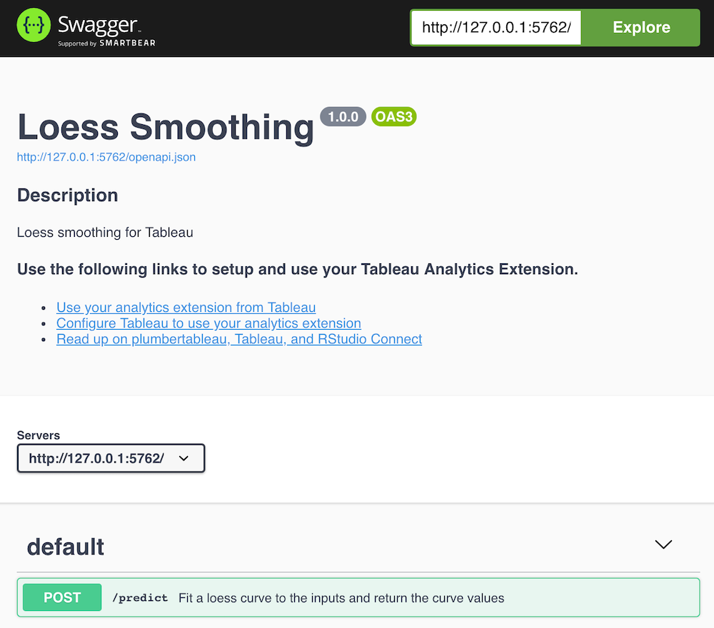

```{r, include = FALSE}
knitr::opts_chunk$set(
  collapse = TRUE,
  comment = "#>"
)

# Load package
library(plumbertableau)

# Set random seed
set.seed(35487)

# R chunks
knitr::read_chunk(path = "../inst/plumber/loess/plumber.R",
                  labels = "loess")
```

## Getting Started {#getting-started}

This vignette will walk you through writing plumbertableau extensions in R. plumbertableau extensions are Plumber APIs with a few additional pieces, and this vignette assumes some familiarity with Plumber (https://www.rplumber.io/). If you're unfamiliar with Plumber, the [Quickstart guide](https://www.rplumber.io/articles/quickstart.html) gives a good overview of that package. Throughout this guide, we'll use the terms "web service" and "API" (application programming interface) interchangeably.

You can install the plumbertableau package from CRAN or GitHub.

```{r, eval = FALSE}
# from CRAN
install.packages("plumbertableau")

# from GitHub
remotes::install_github("rstudio/plumbertableau")
```

Once the package is installed, you can start a new RStudio Project with a
template file from the New Project menu inside RStudio:

{width=75%}

The package also comes with several other example extensions:
```{r}
plumber::available_apis(package = "plumbertableau")
```

These examples can be run and optionally viewed using `plumber::plumb_api()`.

## What can plumbertableau Extensions Do? {#capabilities}

plumbertableau extensions respond to requests from Tableau. In a request, Tableau will provide an [*endpoint*](https://www.rplumber.io/articles/routing-and-input.html?q=endpoint#endpoints-1) — which roughly corresponds to an R function — and will send along one or more *arguments*, which will generally consist of data from Tableau.

An extension *must* return data that's the same number of observations as the arguments it receives. It can do things like transform text, or use a model to predict Y values from a matrix of X values. A plumbertableau extension can't, say, receive an integer representing the number of elements to sample, and return a vector of that length.

## An Example with Loess Regression

Let's start with some plain R code that uses the `loess()` function to fit a smooth line across some input data and plot the result.

```{r fig.width=6.5, fig.height=4.5}
x <- seq(1, 10, length.out = 100)
y <- 1/x^2 + rnorm(length(x), sd = 0.05)
fit <- loess(y ~ x, span = 0.75)
y_fit <- predict(fit, data.frame(x, y))

# Plot the data and prediction.
plot(x, y)
lines(x, y_fit)
```

## The Anatomy of a plumbertableau Extension {#anatomy}

Here's that same model in a finished plumbertableau extension.

```{r loess, eval = FALSE}
```

There are a few parts to our extension which are required to make it work:

- **Annotations**. Comments beginning with `#*` are [annotations](https://www.rplumber.io/articles/annotations.html), which define aspects of the API for Plumber and plumbertableau.
- **Function definitions** — Each function definition must use annotations to describe the data types for all inputs and the value it returns.
- **The Tableau extension footer** — This contains the `tableau_extension` object with the `@plumber` annotation. This does the work of modifying the Plumber router to be Tableau-compatible and is a required component of all plumbertableau extensions.

The `@apiTitle` and `@apiDescription` annotations are used to describe the extension in documentation which is generated.

### Annotating Function Definitions for plumbertableau

Let's look again at our un-annotated function definition.

```{r, eval = FALSE}
#* Annotate me!
function(x, y, alpha = 0.75) {
  alpha <- as.numeric(alpha)
  l_out <- loess(y ~ x, span = alpha)
  predict(l_out, data.frame(x, y))
}
```

It accepts three inputs: `x`, `y`, and `alpha`, fits a `loess()` model using this data, and returns the output of the `predict()` function for that model. We need to annotate the function inputs and output so that plumbertableau can translate the data correctly for Tableau and generate proper documentation for the extension.

**Data provided by Tableau** is described using the `@tableauArg` annotation. These annotations require a name and a type, and can optionally contain a description: `#* @tableauArg Name:Type Description`. In our example:

```{r, eval=FALSE}
#* @tableauArg x:integer X values for fitting
#* @tableauArg y:numeric Y values for fitting
```

Here, `x:integer` specifies the `x` argument by name, and tells plumbertableau to expect an integer vector. The string `X values for fitting` will be used to describe this argument in the generated API documentation. If an argument is optional, this can be noted using `?` after identifying the data type.

```{r , eval=FALSE}
#* @tableauArg y:numeric? Y values for fitting

**Data returned to Tableau** is described with `@tableauReturn`. The syntax is similar to `@tableauArg`, without an argument name: `#* @tableauReturn Type Description`.

```{r, eval=FALSE}
#* @tableauReturn numeric Fitted loess values
```

plumbertableau will expect `numeric` data to be returned, and will describe it as `Fitted loess values` in our documentation.

**URL parameters** are arguments described with Plumber's [`@param`](https://www.rplumber.io/articles/annotations.html#endpoint) annotation. These are useful for providing fixed values that don't use data from Tableau objects. In our example the optional `alpha` parameter lets Tableau users control the degree of smoothing used in the `loess` model.

```{r, eval=FALSE}
#* @param alpha Degree of smoothing
```

Tableau users can now add `?alpha=0.5` to the end of the extension URL to control the degree of smoothing.

**The path** to the endpoint where this function is accessed is annotated with `@post`. Tableau only supports requests using the POST method, so all our Tableau-accessible endpoints must be annotated with `@post`.

### Data Types

plumbertableau understands the following R and Tableau data types.

R type | Tableau type
------ | ------------
`character` | `string`, `str`
`logical` | `boolean`, `bool`
`numeric` | `real`
`integer` | `integer`, `int`

In addition to these described data types, you can use the type `any` to accept any type.
### Tableau Extension Footer

```{r, eval = FALSE}
#* @plumber
tableau_extension
```

In order for a plumbertableau extension to properly respond to Tableau requests, we must put this block at the bottom of our extension. The `@plumber` annotation tells Plumber to use the `tableau_extension` object to modify the router object it uses to handle requests.

Behind the scenes, this object is a [Plumber Router Modifier](https://www.rplumber.io/articles/annotations.html#plumber-router-modifier), and is compatible with [programmatic usage](https://www.rplumber.io/articles/programmatic-usage.html) in Plumber.

## Running and Testing Extensions Locally {#testing}

plumbertableau uses Plumber's ability to generate [Swagger](https://github.com/rstudio/swagger) documentation for APIs.

Once you've written an API, it can be tested locally through the Swagger UI. To start the API, click the Run API button in RStudio, or run `plumber::plumb("path/to/plumber.R")$run()` in the R console. Once the API is running, you'll be presented with an interface like the following:

{width=75%}

Click on the `/predict` endpoint to expand it. You can then click "Try it out" to modify the example request, and "Execute" to send it.

{width=75%}

Requests from Tableau consist of a JSON object with two items^[[Tableau Analytics Extensions API Reference](https://tableau.github.io/analytics-extensions-api/docs/ae_api_ref.html#post-evaluate)]. We can see these in the simple mock request that plumbertableau provides following Tableau's specification.

```{json}
{
  "script": "/predict",
  "data": {
    "_arg1": [
      0
    ],
    "_arg2": [
      0
    ]
  }
}
```

- `script`: A string identifying an endpoint. Behind the scenes, Tableau sends all extension requests to the `/evaluate` endpoint, and plumbertableau uses this string value to correctly route the request to a the requested endpoint.
- `data`: An object containing arguments for the function at the endpoint. plumbertableau parses this data and passes it to the R code. Tableau does not allow explicit naming of arguments, instead naming them `_arg1`, `_arg2`, ... ,`_argN`. Arguments are passed to R in the order in which they appear. In this case, `_arg1` will be passed a `x` and `_arg2` will be passed a `y` to the underlying R function.

To generate a more complex example, we can use `mock_tableau_request()` to create a more full-featured request for use with Swagger. Here, we pass in a data frame with two columns, and `mock_tableau_request()` uses those columns for `_arg` and `_arg2`.

```{r}
mock_tableau_request(script = "/predict", 
             data = mtcars[,c("hp", "mpg")])
```

Note that because the running API occupies your R session, you'll have to stop running it to use `mock_talbeau_request()`. Once you've generated a mock request, you can run the API again and paste the request into the Swagger documentation to test the API. The data that would be sent back to Tableau appears under "Response body".

It's also worth noting that the `curl` command used by OpenAPI to submit the request doesn't exactly match the request sent by Tableau, since the `curl` request goes to the actual endpoint (in this case `/predict`) and requests from Tableau will go to `/evaluate` and then be routed to `/predict`. The request response will still be the same.

### Debugging Extensions {#debugging}

plumbertableau supports debug logging via the [`debugme`](https://github.com/r-lib/debugme) R package.

To turn on debug messages in R, set the `DEBUGME` environment variable to a value containing `plumbertableau` in R before the package is loaded.

```r
Sys.setenv(DEBUGME = "plumbertableau")
library(plumbertableau)
```

Additional messages will be logged to the R console while the extension is running, with information about the contents and processing of each request the extension receives.

## Deploying Extensions

Now that we've written our extension, we can deploy it to RStudio Connect and use it from Tableau. 

- To learn how to publish and manage extensions on RStudio Connect, and how to configure Tableau to work with RStudio Connect, see the **[RStudio Connect documentation on Tableau integration](https://docs.posit.co/rsc/integration/tableau/)**.
- For more information about using extensions from Tableau, see **[Using plumbertableau Extensions in Tableau](tableau-developer-guide.html)**
