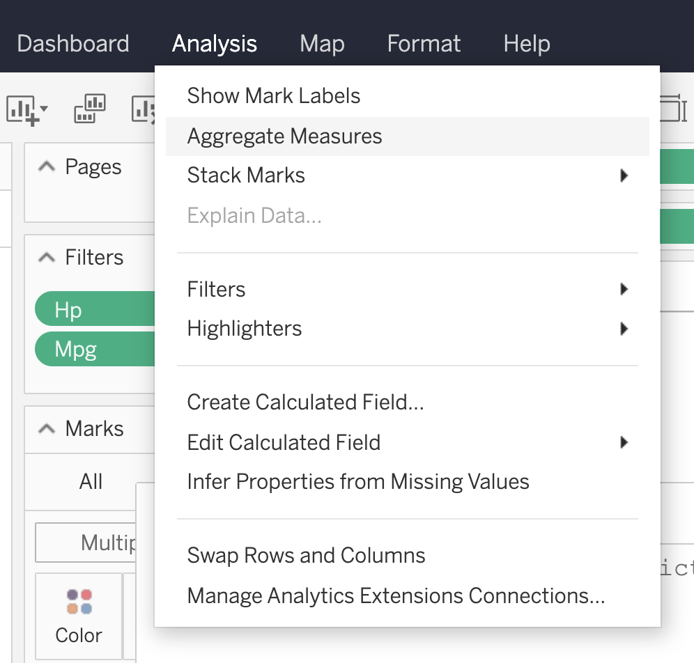

```{r, include = FALSE}
knitr::opts_chunk$set(
  collapse = TRUE,
  comment = "#>"
)
```

Analytics extensions built with `plumbertableau` are designed to be easily used from within Tableau Workbook calculated fields. When extensions are published to RStudio Connect, a Tableau usage guide is automatically generated. When viewing an extension on RStudio Connect, users will see a page like the following:

{width=75%}

This page details exactly what is necessary to use the extension from within Tableau.

{width=75%}

In order to ensure values are correctly passed from Tableau to the extension, Tableau aggregation needs to be turned off.

{width=75%}
