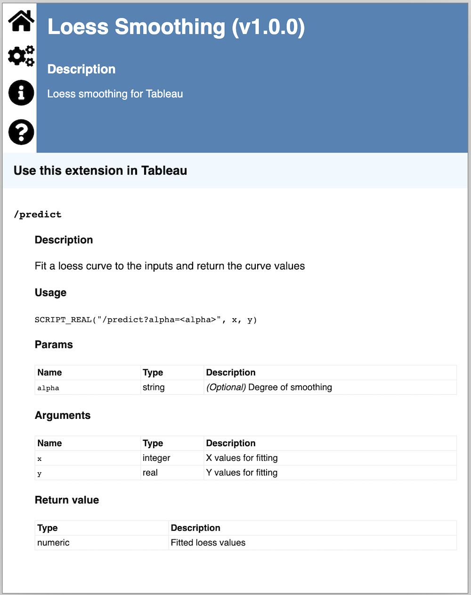
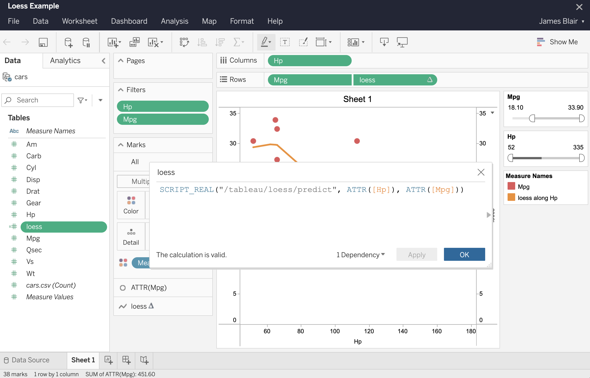

```{r, include = FALSE}
knitr::opts_chunk$set(
  collapse = TRUE,
  comment = "#>"
)
```

Before you use plumbertableau extensions in Tableau, you'll need to configure your extension server in Tableau. See **["Publishing plumbertableau Extensions to RStudio Connect"](publishing-extensions.html)** for detailed instructions on setting up Tableau and  RStudio Connect to work together.

plumbertableau extensions are used within calculated fields in Tableau, with calls to [Tableau's `SCRIPT_*` functions](https://help.tableau.com/current/pro/desktop/en-us/functions_functions_tablecalculation.htm#scriptbool).

## Viewing Info on an Extension

plumbertableau automatically generates a documentation page with example calls for each endpoint in the extension. These are what you see when you view the extension on RStudio Connect.

{width=75%}

This page includes the following information about the extension:

- The API's name and description
- Links to other important pieces of documentation, including instructions for configuring Tableau, and the OpenAPI (Swagger) documentation for the extension

For each endpoint, it includes:

- A usage example calling Tableau's appropriate `SCRIPT_*` command, ready for use in a Tableau workbook
- Names, types, and descriptions for Tableau arguments, URL parameters, and return data returned

## Calling an Extension Endpoint in Tableau

You can copy and paste the usage example (the `SCRIPT_*` command) into a calculated field in Tableau (it generates the correct URL), and replace the argument placeholders with actual values from the Tableau workbook.

{width=75%}

### Working with Tableau Data

We've found that a few practices in Tableau ensure that the data you pass to a plumbertableau extension is sent correctly.

- You must turn off "Aggregate Measures" under the "Analysis" menu for Tableau to pass the correct values to the extension. If this setting is on, Tableau will send aggregated data to the extension, which may cause inaccuracies in computations.
- With this value off, calculated fields don't allow you to pass raw values directly to an extension. Those values must be wrapped in an aggregating function. Since we've turned "Aggregate Measures" off, these functions won't actually aggregate the data. We've had success using `ATTR([VALUE_NAME])`.
